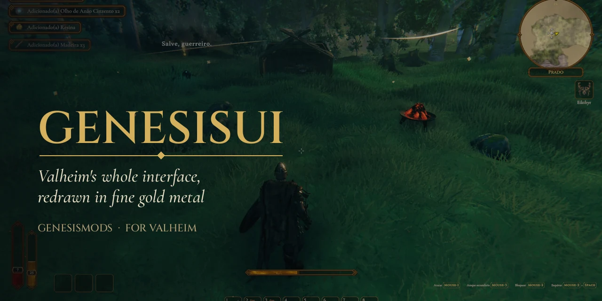
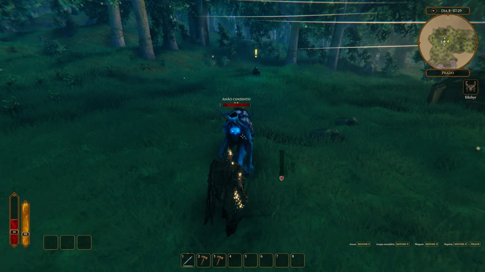
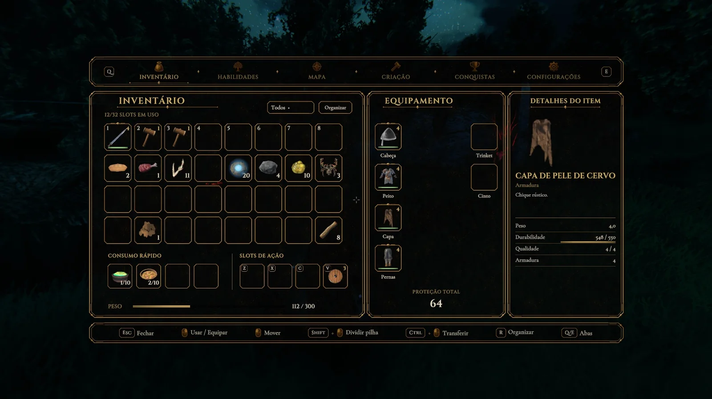
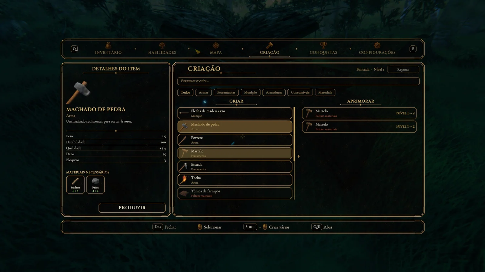
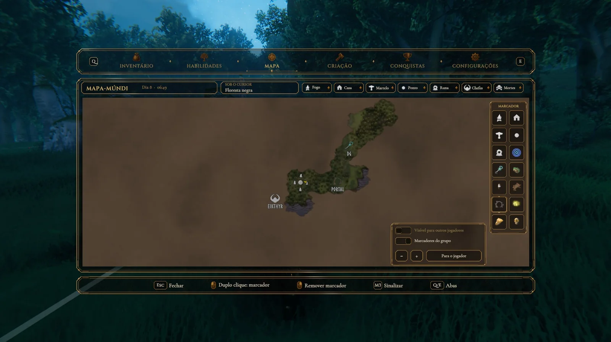
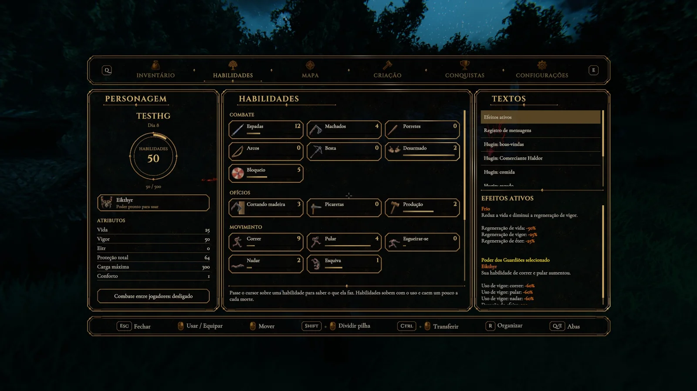

<div align="center">



### Toda a interface do Valheim, redesenhada em metal dourado fino

Barras vivas, janelas claras e um mapa emoldurado — com a interface do próprio jogo rodando por baixo,<br>
então seus outros mods continuam funcionando e qualquer parte pode voltar a ser a original.

[**Baixar no Hexium**](https://valheim.hexium.gg/mods/GenesisMods/GenesisUI) · [**Discord**](https://discord.gg/TZ785sYtgx) · [**Read in English**](README.md)

[](CHANGELOG.md)
[](https://valheim.com)
[](https://github.com/Valheim-Modding/Jotunn)
[](LICENSE)
[](https://discord.gg/TZ785sYtgx)

</div>

Versão atual: [**1.1.2 — baixar no GitHub**](https://github.com/brkihel/GenesisUI/releases/tag/v1.1.2), aprovada por Diego: previews 3D corrigidos, brilho ao equipar, lore em runas e correções de estabilidade. [Registro do Release](docs/releases/1.1.2.md). O upload no Hexium segue como próximo passo de Diego; [adaptadores dos mods](docs/CAPABILITIES.md) seguem como trabalho futuro.

---

## Um HUD que parece vivo

Vida, vigor e eitr em barras de líquido que se mexem e queimam quando você leva dano. Minimapa redondo com dia, hora e bioma. Placas de chefes e criaturas, comidas e efeitos que você lê num relance.



## Um inventário que faz sentido

A sua bolsa, o seu equipamento e o item que você está olhando, lado a lado, com previews 3D e brilho dourado acompanhando o equipamento. Espaços extras de uso rápido e utilitários. **R** organiza; **Q** e **E** trocam entre inventário, habilidades, mapa, criação, conquistas e configurações.



## Criação sem adivinhar

Em qualquer estação, o que dá para fazer aparece primeiro e o que falta aparece escrito. Criar e aprimorar lado a lado, com o ganho do aprimoramento antes de gastar.



## Um mapa que vale abrir

O mapa numa moldura de verdade, com filtros e oito marcadores novos — masmorra, minério, covil, base, portal, tesouro, comerciante, perigo — salvos como marcadores comuns, então o mundo nunca depende do mod.



## Recursos

<table>
<tr>
<td width="50%" valign="top">

**HUD**
- Barras vitais de líquido, com rastro de queima e pulso de vida baixa
- Minimapa redondo com vento, dia, hora e bioma
- Barra de atalhos, comidas, efeitos e poder do guardião
- Placas de chefes e criaturas, cartão de interação, notificações
- Dicas de teclas no mesmo estilo, na metade do tamanho

</td>
<td width="50%" valign="top">

**Janelas**
- Inventário com espaços de uso rápido, utilitários e equipamento, e organizar
- Previews 3D do personagem/itens e progresso de equipamento na borda dourada
- Lore e textos de guardião revelados aos poucos a partir de runas
- Criar e aprimorar em todas as estações
- Habilidades e personagem, conquistas, configurações do GenesisUI
- Comerciante, dividir pilha, variantes, campo de texto
- Menu Esc com o jogo desfocado

</td>
</tr>
<tr>
<td width="50%" valign="top">

**Mapa e construção**
- Mapa emoldurado com filtros, zoom e "para o jogador"
- Oito tipos de marcador além dos do jogo
- Menus do martelo, enxada e cultivador com busca e favoritos
- Cartão de posicionamento ao construir

</td>
<td width="50%" valign="top">

**Seguro por padrão**
- Cada parte pode ser desligada na hora; a do jogo volta
- Uma parte com falha fecha, se reconstrói e explica o que houve
- O jogo continua sendo o motor: itens, marcadores e mensagens de outros mods aparecem
- Nenhuma mensagem de rede de jogabilidade; só a trava opcional do servidor para os espaços (ServerSync)

</td>
</tr>
</table>



## Instalação

Com um gerenciador de mods (Hexium, Gale, r2modman): instale o **GenesisUI**; o Jötunn vem junto.

Manual: BepInExPack para Valheim e [Jötunn](https://github.com/Valheim-Modding/Jotunn), depois extraia a pasta `plugins` do pacote em `BepInEx/plugins/GenesisUI`.

O GenesisUI é um mod de cliente. Num servidor dedicado ele é opcional e só mantém igual para todos a configuração dos espaços do inventário; quem não tem o mod entra normalmente.

## Configurações

No jogo, abra o inventário e vá à aba **Configurações** (ou `BepInEx/config/Genesis.GenesisUI.cfg`). Cada parte da interface tem o seu interruptor em *Módulos*.

## Suporte

Pergunte no [**Discord da GenesisMods**](https://discord.gg/TZ785sYtgx). Para um bug, aperte **F8** no jogo para salvar um relatório (sem dados pessoais) e poste em **#valheim-bugs** com o `BepInEx/LogOutput.log`.

Veja as [notas de versão](CHANGELOG.md).

## Para desenvolvedores

O GenesisUI é feito com segurança e estabilidade em primeiro lugar: esconde a interface do jogo em vez de destruí-la, cada membro do jogo que ele toca é um contrato conferido por testes, e cada falha fica dentro do seu módulo. A documentação técnica está em inglês, em [`docs/`](docs/) (comece por [ARCHITECTURE](docs/ARCHITECTURE.md)) e no [AGENTS](AGENTS.md).

```bash
dotnet build GenesisUI.sln -c Release
dotnet test GenesisUI.sln -c Release
tools/package.sh Release
```

## Licença

Código: MIT ([LICENSE](LICENSE)). Fontes: SIL Open Font License 1.1 (`art/fonts/`). Arte original: [art/LICENSES.md](art/LICENSES.md).

Valheim é marca da Iron Gate AB. O GenesisUI não é afiliado à Iron Gate AB nem à Coffee Stain.

<div align="center">
<br>
<sub>Feito por <a href="https://github.com/brkihel">BRKiHeL</a> · <a href="https://discord.gg/TZ785sYtgx">GenesisMods</a></sub>
</div>
